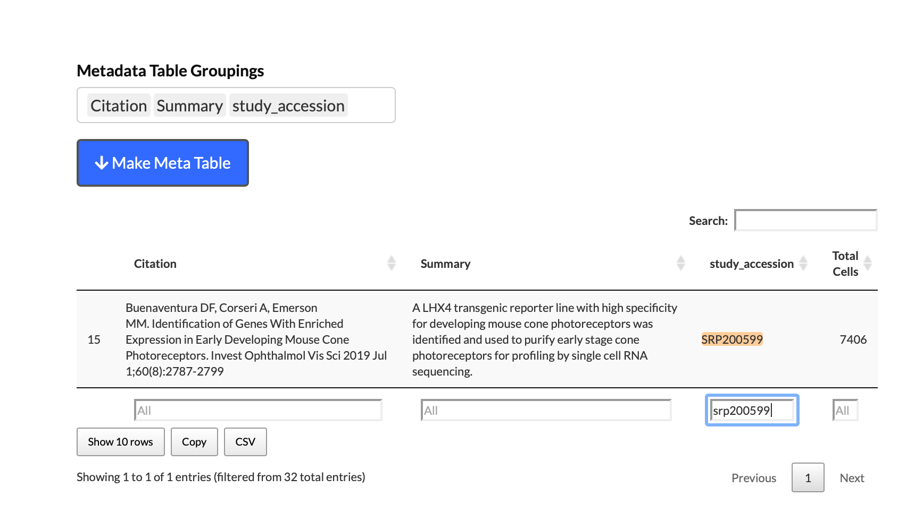
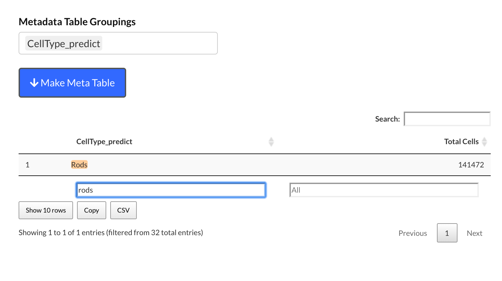
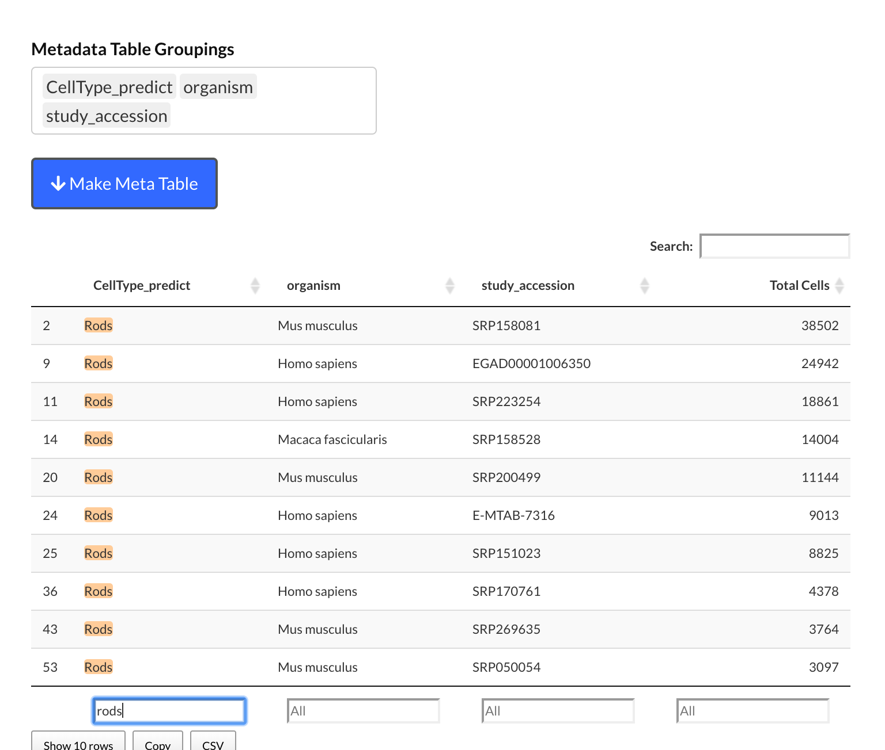
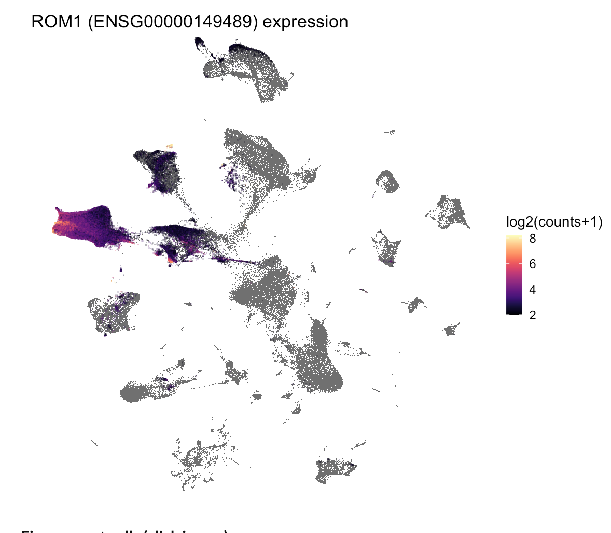

# Welcome

This document contains some simple examples for how to use the advanced filtering options in [https://plae.nei.nih.gov]()

# Gene Focused

By "gene focused" we mean that:

1. You have a gene you are interested in
2. You want to learn more about where / when / what it is expressed in

## *In silico* *In Situ*

For those who are most comfortable with stained *in situ* slices of the retina this visualization may be useful. The major cell types of the retina are laid on in rough anatomical positioning. The cell types are colored by intensity, with the brighter colors meaning that the gene is more highly expressed in that cell type. As an example we show expression of RHO (rhodopsin, a rod marker) and RPE65 (RPE marker).


## UMAP - Table

If you are curious about a gene, then there are several ways you can learn about its retinal cell type expression patterning. We will use [ATOH7](https://www.sciencedirect.com/science/article/pii/S0012160612001418?via%3Dihub), a transcription factor that regulates retinal ganglion development as our example gene. 

The UMAP view is a two dimensional representation of the individual cells in the scEiaD. Cells that are closer together have more related gene expression profiles (and thus are likely to be similar cell types). 

Let's go the UMAP - Table viewer in plae:

Viz -> UMAP - Tables

{width=50%}

Gray are cells which have no detectable ATOH7.

Yellow is the highest expression. Dark blue the lowest (notice the legend).

{width=50%}

## Show highest expressing cells

What if we want to see which cells have the highest expression? We can use the "Filter Gene Expression" slider to only show cells with expression above a log2(expression) value.

We see that the highest expressing cells are in the "center" before the branching happens.

{width=50%}

## Species Filtering

By default plae shows data for all organisms in the database (human, mouse, macaque). 

If we only want to see ATOH7 expression in human data, then that is very easy with the powerful "Scatter Filter Category" and "Gene Filter On" sections.

{width=50%}

## Table Information

While the UMAP view is cool looking, it can't show you everything....what if we want to know what kind of cells are expressing ATOH7?

We can have quantified information on where ATOH7 is expressed by Cell Type (predicted) (this is our machine learned cell type labels) and organism.

{width=50%}

We see that about 50% of the mouse and human neurogenic cell type express ATOH7. In raw counts that is 9173 of 170101 total mouse neurogenic cells. They have an average expression of 6.86. You can sort or filter the table based on queries. If you wanted to see ATOH7 expression in the RGCs this is trivial to do by typing in the box below.

{width=50%}

This shows us that ATOH7 expression seems to be dropping in the maturing/mature RGCs (and is much lower in the macaque) relative to the neurogenic population. 

## Study filtering

As scEiaD is constructed from publicly available datasets, you can also filter the data to only show results from a specific paper. This may be useful if you using the results from that paper and want to check or confirm a finding. 

You can see information about the papers / studies in scEiaD by using the adjacent "Make Meta Table" section as follows:

{width=50%}

We see that the Clark et al. 2019 study did Smart-seq2 and 10X across many developmental time points in mouse. They study_accession ID is SRP158081. We can use this ID to look at ATOH7 expression only in this study in both the UMAP view and the table view

{width=50%}

{width=50%}


# Expression Plot

As we have a huge number of studies and samples, we can use this (for single cell data) unusual view: a boxplot! We can see how ATOH7 expression changes across celltype *and* study.

## How do we get here?


## Make a plot....that shows nothing?

We've entered ATOH7 as the gene to plot (1). We are faceting (splitting the plot into separate sub-plots) on Cell Type (predict) (2). We are coloring the data points by study_accession (each study's average gene expression across the Cell Type (predict) is plotted separately) (3). But we see ... nothing. Why?


That is because the Plot Height (400) is not high enough. The text is prioritized over the data, so they are hidden. As it is extremely difficult to "auto" pick the correct height, it was more straightforward to have the user pick it. Usually a value of 1000 will give a reasonable view.

## Useable plot


So yes, now we can see the data. 

## Some cones have ATOH7 expression?

So each point is an independent study. We see high ATOH7 expression in the neurogenic population, across many studies. But we also see *some* of the Cones with ATOH7 expression. The legend shows which colors correspond to which study.


One of the studies is a bright purple...probably SRP200599. We can confirm that by replotting the data with a filter that only shows study_accessionSRP200599.


Yep, that is it. We can jump to the UMAP - Table view to pull up the metadata we have extracted about the study. 



This is from [Buenaventura et al. ](https://pubmed.ncbi.nlm.nih.gov/31260032/) and is a study that enriched early mouse cones. Some [work](https://www.sciencedirect.com/science/article/pii/S1534580720303075?via%3Dihub) suggests that loss of ATOH7 inhibits cone specification. These cones may be "early" cones or late neurogenic cells that are developing into cones. 


# Cell Type Focused

If you want to get a sense about *what* is present in scEiaD, then there are several tools you can use. For our example, we will be starting with the rods.

## How many rods do we have?
These are published labels


## How many rods do we have after the machine learning?


## How many rods (predicted) do we have across organism?


## How many rods (predicted) we we have across organism and study?

## What genes are differentially expressed in the Rods?


## And what does ROM1 expression look like in the UMAP?



Very high expression in the rods (and expressed in other cells too)

# Advanced Stuff - Analysis in R

We provide the full data as seurat (v3) or anndata (scanpy) objects you can download for boutique analysis. Here we demonstrate how you can use the Seurat object to run a quick custom diff test on a sub-population of neurogenic cells. 

```{r}
library(Seurat)
library(tidyverse)
#system('wget -O ~/Downloads/scEiaD_all_seurat_v3.Rdata http://hpc.nih.gov/~mcgaugheyd/scEiaD/2021_02_17/scEiaD_all_seurat_v3.Rdata')
load('~/Downloads/scEiaD_all_seurat_v3.Rdata')
```

## ID neurogenic cells in different clusters
```{r}
scEiaD_droplet@meta.data %>% 
  group_by(cluster, CellType_predict) %>% 
  summarise(Count = n()) %>% 
  mutate(Perc = (Count / sum(Count)) * 100) %>% 
  filter(Perc > 5) %>% 
  filter(CellType_predict == 'Neurogenic Cells') %>% 
  arrange(-Perc)
```

The most common is cluster 6 and 7 (by both count and proportion that is Neurogenic)

## Compare cluster 6 - Neurogenic vs cluster 7 - Neurogenic
This will take a few minutes to run. This is why we cannot offer on-demand custom diff testing as it takes at least a few minutes to run and the whole app shuts down for *everyone* while it computes. 
```{r}
# Create new column with a pasted together cluster ID and a CellType
scEiaD_droplet <- AddMetaData(scEiaD_droplet, 
                              metadata = 
                                paste0(
                                  scEiaD_droplet@meta.data$cluster, 
                                  '_', 
                                  scEiaD_droplet@meta.data$CellType_predict
                                  ), 
                              col.name = 'clusterCT' )
# tell Seurat this new column is the default identity
Idents(scEiaD_droplet) <- scEiaD_droplet@meta.data$clusterCT
diff_test <- FindMarkers(scEiaD_droplet, ident.1 = '6_Neurogenic Cells', ident.2 = '7_Neurogenic Cells')
diff_test %>% arrange(-avg_logFC) %>% head(5)
```

We see the top hit (by log fold change) that is overexpressed in cluster6-Neurogenic is ENSG00000131747 (TOP2A), which is a marker of cell proliferation. 


## ID RPE cells in different clusters
```{r}
scEiaD_droplet@meta.data %>% 
  group_by(cluster, CellType_predict) %>% 
  summarise(Count = n()) %>% 
  mutate(Perc = (Count / sum(Count)) * 100) %>% 
  filter(Perc > 5) %>% 
  filter(CellType_predict == 'RPE') %>% 
  arrange(-Perc)
```

The most common is cluster 6 and 7 (by both count and proportion that is Neurogenic)

## Compare cluster 37 - RPE vs cluster 46 - RPE
This will take a few minutes to run. This is why we cannot offer on-demand custom diff testing as it takes at least a few minutes to run and the whole app shuts down for *everyone* while it computes. 
```{r}
# Create new column with a pasted together cluster ID and a CellType
scEiaD_droplet <- AddMetaData(scEiaD_droplet, 
                              metadata = 
                                paste0(
                                  scEiaD_droplet@meta.data$cluster, 
                                  '_', 
                                  scEiaD_droplet@meta.data$CellType_predict
                                  ), 
                              col.name = 'clusterCT' )
# tell Seurat this new column is the default identity
Idents(scEiaD_droplet) <- scEiaD_droplet@meta.data$clusterCT
diff_test <- FindMarkers(scEiaD_droplet, ident.1 = '37_RPE', ident.2 = '46_RPE')
diff_test %>% arrange(-avg_logFC) %>% head(5)
```
A top gene is vimentin, which has been previously identified as over-expressed in cultured RPE (https://pubmed.ncbi.nlm.nih.gov/1700982/). The RPE in cluster 37 are iPSC-based.. 

## Check RPE65, TTR, TYRP1 and Vimentin expression across the two RPE cluster
RPE65, TTR, and TYRP1 are markers for functional RPE and are high in both groups of RPE. Vimentin is much higher in the iPSC RPE cluster (37).
```{r}
scEiaD_droplet__RPE <- subset(scEiaD_droplet, idents = c('37_RPE','46_RPE'))
VlnPlot(scEiaD_droplet__RPE, features = c('ENSG00000116745', 'ENSG00000107165', 'ENSG00000118271', 'ENSG00000026025'))
```


