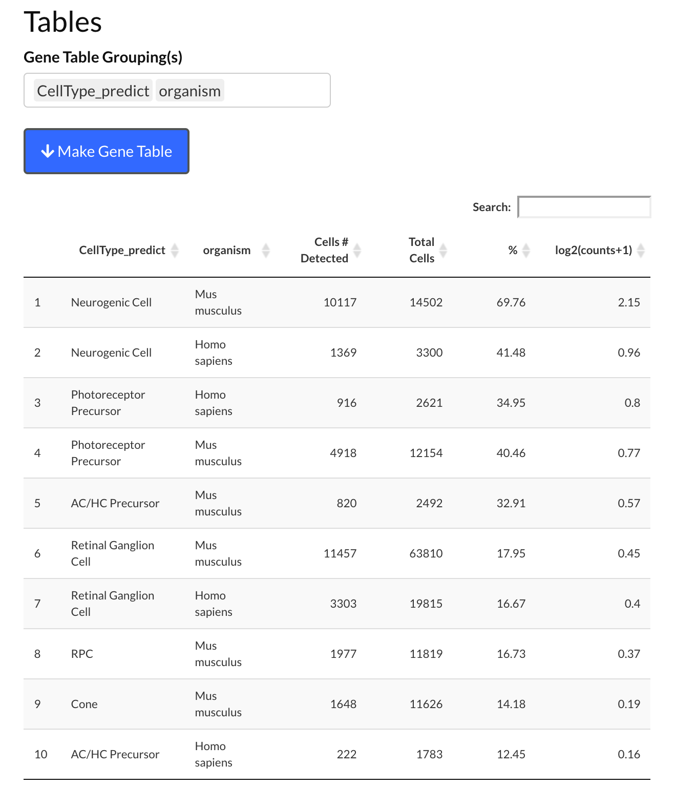
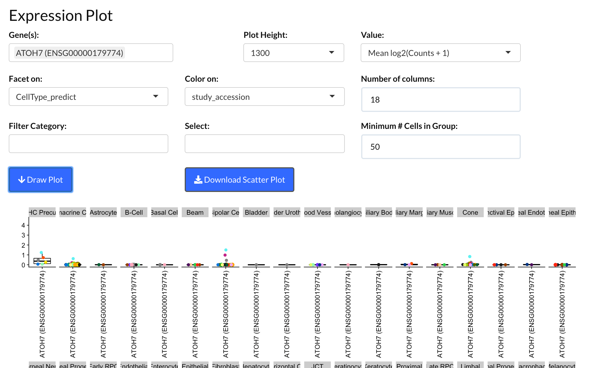
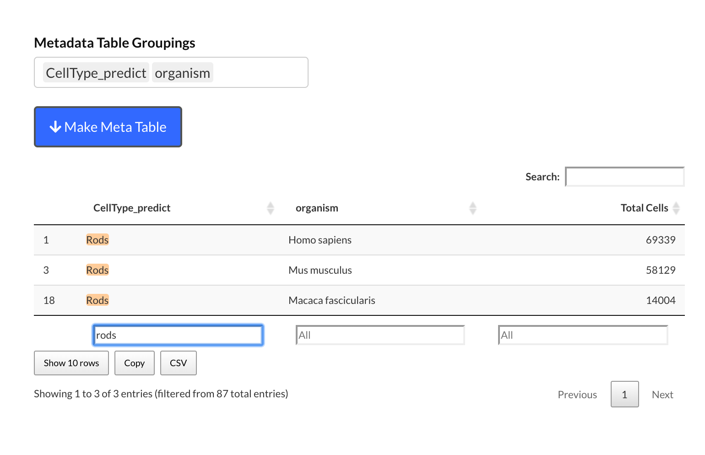

# Welcome

This document contains some simple examples for how to use the advanced filtering options in [https://plae.nei.nih.gov]() and a brief introduction to using the Seurat file to do custom tests. 

# Gene Focused

By "gene focused" we mean that:

1. You have a gene you are interested in
2. You want to learn more about where / when / what it is expressed in

## *In silico* *In Situ*

For those who are most comfortable with stained *in situ* slices of the retina this visualization may be useful. The major cell types of the retina are laid on in rough anatomical positioning. The cell types are colored by intensity, with the brighter colors meaning that the gene is more highly expressed in that cell type. As an example we show expression of RHO (rhodopsin, a rod marker) and RPE65 (RPE marker).

{width=50%}

{width=50%}


## UMAP - Table

If you are curious about a gene, then there are several ways you can learn about its retinal cell type expression patterning. We will use [ATOH7](https://www.sciencedirect.com/science/article/pii/S0012160612001418?via%3Dihub), a transcription factor that regulates retinal ganglion development as our example gene. 

The UMAP view is a two dimensional representation of the individual cells in the scEiaD. Cells that are closer together have more related gene expression profiles (and thus are likely to be similar cell types). 

Let's go the UMAP - Table viewer in plae:

Viz -> UMAP - Tables

{width=75%}

Dark gray are cells which have no detectable ATOH7.

Yellow is the highest expression and dark purple is the lowest expression. 

{width=75%}

## Show highest expressing cells

What if we want to see which cells have the highest expression? We can use the "Filter Gene Expression" slider to only show cells with expression above a log2(expression) value.

We see that the highest expressing cells are in the "center" before the branching happens.

{width=75%}

## Species Filtering

By default plae shows data for all organisms in the database (human, mouse, macaque). 

If we only want to see ATOH7 expression in human data, then that is very easy with the powerful "Scatter Filter Category" and "Gene Filter On" sections.

{width=75%}

## Table Information

While the UMAP view is cool looking, it can't show you everything....what if we want to know what kind of cells are expressing ATOH7?

We can have quantified information on where ATOH7 is expressed by Cell Type (predicted) (this is our machine learned cell type labels) and organism.

{width=75%}

We see that about 50% of the mouse and human neurogenic cell type express ATOH7. In raw counts that is 16,449 of 28,811 total mouse neurogenic cells. They have an average expression of 1.86. You can sort or filter the table based on queries. If you wanted to see ATOH7 expression in the RGCs this is trivial to do by typing in the box below.

{width=75%}

This shows us that ATOH7 expression seems to be dropping in the maturing/mature RGCs (and is much lower in the macaque) relative to the neurogenic population. 

## Study filtering

As scEiaD is constructed from publicly available datasets, you can also filter the data to only show results from a specific paper. This may be useful if you using the results from that paper and want to check or confirm a finding. 

You can see information about the papers / studies in scEiaD by using the adjacent "Make Meta Table" section as follows:

{width=75%}

We see that the Clark et al. 2019 study did Smart-seq2 and 10X across many developmental time points in mouse. They study_accession ID is SRP158081. We can use this ID to look at ATOH7 expression only in this study in both the UMAP view and the table view

{width=75%}

{width=75%}


# Expression Plot

As we have a huge number of studies and samples, we can use this (for single cell data) unusual view: a boxplot! We can see how ATOH7 expression changes across celltype *and* study.

## How do we get here?


## Make a plot....that shows nothing?

We've entered ATOH7 as the gene to plot (1). We are faceting (splitting the plot into separate sub-plots) on Cell Type (predict) (2). We are coloring the data points by study_accession (each study's average gene expression across the Cell Type (predict) is plotted separately) (3). But we see ... nothing. Why?


That is because the Plot Height (400) is not high enough. The text is prioritized over the data, so they are hidden. As it is extremely difficult to "auto" pick the correct height, it was more straightforward to have the user pick it. Usually a value around 700 - 1200 will give a reasonable view.

## Useable plot


So yes, now we can see the data. 

## Some cones have ATOH7 expression?

So each point is an independent study. We see high ATOH7 expression in the neurogenic population, across many studies. But we also see one of studies with ATOH7 expression in cones. The legend shows which colors correspond to which study.


One of the studies is a bright pink...probably SRP200599. We can confirm that by re-plotting the data with a filter that only shows study_accession SRP200599.


Yep, that is it. We can jump to the UMAP - Table view to pull up the metadata we have extracted about the study. 


This is from [Buenaventura et al. ](https://pubmed.ncbi.nlm.nih.gov/31260032/) and is a study that enriched early mouse cones. Some [work](https://www.sciencedirect.com/science/article/pii/S1534580720303075?via%3Dihub) suggests that loss of ATOH7 inhibits cone specification. These cones may be "early" cones or late neurogenic cells that are developing into cones. 


# Cell Type Focused

If you want to get a sense about *what* is present in scEiaD, then there are several tools you can use. For our example, we will be starting with the rods.

## How many rods do we have?
These are published labels


## How many rods do we have after the machine learning?


## How many rods (predicted) do we have across organism?


## How many rods (predicted) we we have across organism and study?


## What genes are differentially expressed in the Rods?


## And what does ROM1 expression look like in the UMAP?


Very high expression in the rods (and expressed in other cells too)

# Advanced Stuff - Analysis in R

We provide the full data as seurat (v3) or anndata (scanpy) objects you can download for boutique analysis. Here we demonstrate how you can use the Seurat object to run a quick custom diff test on a sub-population of neurogenic cells. The Seurat object is 25 GB in size and likely will cause serious memory issues on a generic laptop. 

```{r}
library(Seurat)
library(tidyverse)
library(SingleCellExperiment)
library(scran)
library(org.Hs.eg.db)
#system('wget -O ~/data/scEiaD/scEiaD_all_seurat_v3.Rdata https://hpc.nih.gov/~mcgaugheyd/scEiaD/2021_11_11/scEiaD_all_seurat_v3.01.Rdata)
# the -O renames the file and puts it in the ~/data/scEiaD directory
load('/Volumes/McGaughey_S/scEiaD_v3/scEiaD_all_seurat_v3.Rdata')
```

## ID neurogenic cells in different clusters
We see that the neurogenic cells are a small minority of these clusters. But perhaps still we can find some interesting differences between them. 
```{r}
scEiaD_droplet@meta.data %>% 
  group_by(cluster, CellType_predict) %>% 
  summarise(Count = n()) %>% 
  mutate(Perc = (Count / sum(Count)) * 100) %>% 
  filter(Perc > 5) %>% 
  filter(CellType_predict == 'Neurogenic Cell') %>% 
  arrange(-Count)
```

The most common is cluster 46 and 47

### Compare cluster 46 - Neurogenic vs cluster 47 - Neurogenic
This will take a few minutes to run. This is why we cannot offer on-demand custom diff testing as while it runs the whole app shuts down for *everyone* while it computes. 
```{r}
# Create new column with a pasted together cluster ID and a CellType
scEiaD_droplet <- AddMetaData(scEiaD_droplet, 
                              metadata = 
                                paste0(
                                  scEiaD_droplet@meta.data$cluster, 
                                  '_', 
                                  scEiaD_droplet@meta.data$CellType_predict
                                  ), 
                              col.name = 'clusterCT' )
# tell Seurat this new column is the default identity
Idents(scEiaD_droplet) <- scEiaD_droplet@meta.data$clusterCT
diff_test <- FindMarkers(scEiaD_droplet, ident.1 = '46_Neurogenic Cell', ident.2 = '47_Neurogenic Cell')
diff_test %>% arrange(p_val) %>% filter(abs(avg_log2FC) > 2) %>% head(5)
```

We see the top hit (by p value and log2FC > 2) is HMGB2 (ENSG00000164104), which is associated with a transition from quiescent to proliferative neurogenesis (https://pubmed.ncbi.nlm.nih.gov/28771884/). 


## Compare macula cones vs peripheral cones
Let us now demonstrate how having a deeply collated set of data can be of value in asking more specific questions, like "how do macula/fovea cones differ relative to peripheral cones."

First, we need to see whether this is even a tractable question.
```{r}
scEiaD_droplet@meta.data %>% 
  as_tibble() %>% 
  group_by(retina_region, organism, study_accession, CellType_predict) %>% 
  summarise(Count = n()) %>% 
  filter(CellType_predict %in% c("Cone")) %>% 
  filter(Count > 10, !is.na(retina_region))
```
```{r}
# Create new column with a pasted together cluster ID and a CellType
scEiaD_droplet <- AddMetaData(scEiaD_droplet, 
                              metadata = 
                                paste0(
                                  scEiaD_droplet@meta.data$retina_region, 
                                  '_', 
                                  scEiaD_droplet@meta.data$CellType_predict,
                                  '_',
                                  scEiaD_droplet@meta.data$organism
                                  ), 
                              col.name = 'regionCT')

# filter down scEiaD
Idents(scEiaD_droplet) <- scEiaD_droplet@meta.data$regionCT
scEiaD_droplet__subset <- subset(scEiaD_droplet, idents = c('Macula_Cone_Homo sapiens','Peripheral_Cone_Homo sapiens'))

# create SCE object so we can use the scran test which balances covariates
sce <- as.SingleCellExperiment(scEiaD_droplet__subset)

# run test, blocking (covariate) for study accession
sce_diff_test <- findMarkers(sce,
                group = sce$regionCT,
                block = sce$study_accession,
                pval.type = 'all',
                test="wilcox")
# while the default test is a wilcox which returns an AUC 
# I like to also run a t test which returns a logFC which is useful in filtering
# as something with a high AUC (power to distinguish between groups) but
# a low logFC is less likely to be interesting
sce_diff_test_t <- findMarkers(sce,
                group = sce$regionCT,
                block = sce$study_accession,
                pval.type = 'all',
                test.type = 't')

# get human understandable gene name
library(org.Hs.eg.db)
symbols <- mapIds(org.Hs.eg.db, keys = row.names(sce_diff_test$`Macula_Cone_Homo sapiens`), keytype = "ENSEMBL", column="SYMBOL")
auc_test <- sce_diff_test$`Peripheral_Cone_Homo sapiens` %>% 
  as_tibble(rownames = 'name') %>% 
  left_join(symbols %>% enframe()) %>% 
  filter(FDR < 0.01) %>% 
  dplyr::rename(p.value.auc = p.value,
         FDR.auc = FDR)
t_test <- sce_diff_test_t$`Peripheral_Cone_Homo sapiens` %>% 
  as_tibble(rownames = 'name') %>% 
  filter(FDR < 0.01) %>% 
    dplyr::rename(p.value.t = p.value,
         FDR.t = FDR)

auc_test %>% 
  left_join(t_test, by = 'name') %>% 
  filter(FDR.auc < 0.01, FDR.t < 0.01) %>% 
  filter(summary.AUC > 0.7 | summary.AUC < 0.3) %>% 
  filter(abs(summary.logFC) > 1) %>% 
  arrange(-`logFC.Macula_Cone_Homo.sapiens`)
```

## Always look at the plots

### PDE6H 
Top gene more highly expressed in the macula compared to the periphery. But ... seems to be driven by just one study (SRP151023). So this doesn't look like a good candidate to me. 
```{r, fig.alt = 'PDE6H gene violin plot splitting by study and fovea vs periphery'}
VlnPlot(scEiaD_droplet__subset, features = c('ENSG00000139053'))

VlnPlot(scEiaD_droplet__subset, c('ENSG00000139053'), split.by = 'regionCT', group.by='study_accession', ) + aes(color=scEiaD_droplet__subset$regionCT)
```

### PCP4
The effect is consistent across multiple studies, which increases confidence this is a real pattern.

PCP4 modulates calmodulin, which is involved in cone photoreceptor ribbon replenishment (https://pubmed.ncbi.nlm.nih.gov/25311636/). So maybe not crazy? Or maybe it is. I only know a dangerous amount about retinal function. 
```{r, fig.alt = 'PCP4 gene violin plot splitting by study and fovea vs periphery'}
VlnPlot(scEiaD_droplet__subset, features = c('ENSG00000183036'))

VlnPlot(scEiaD_droplet__subset, c('ENSG00000183036'), split.by = 'regionCT', group.by='study_accession', ) + aes(color=scEiaD_droplet__subset$regionCT)
```

